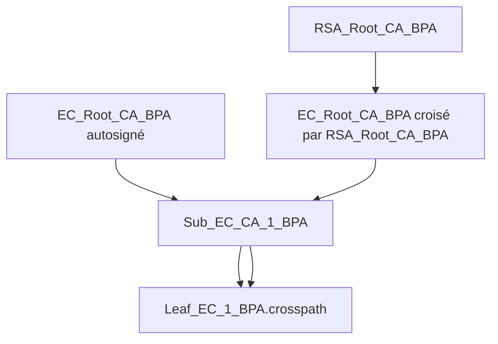

# Certification croisée

## 1. Ce qu’induit une certification croisée dans un seul sens

Une certification croisée dans un seul sens signifie qu’une autorité de certification est attestée par une autre, mais pas l’inverse.

Ici, le chemin construit est:

- `RSA_Root_CA_BPA` signe `EC_Root_CA_BPA`

Conséquence:

- un validateur qui fait confiance à `RSA_Root_CA_BPA` peut remonter jusqu’à la hiérarchie EC;
- un validateur qui fait seulement confiance à `EC_Root_CA_BPA` ne gagne aucun droit automatique à valider la hiérarchie RSA;
- le sens inverse demanderait un second certificat croisé distinct.

Le certificat croisé produit est:

- [`certs/EC_Root_CA_BPA.cross-signed-by-RSA_Root_CA_BPA.crt`](./certs/EC_Root_CA_BPA.cross-signed-by-RSA_Root_CA_BPA.crt)

## 2. Chaîne possible et chaîne impossible

### Chaîne possible

```text
RSA_Root_CA_BPA
  -> EC_Root_CA_BPA (certificat croisé signé par RSA_Root_CA_BPA)
  -> Sub_EC_CA_1_BPA
  -> Leaf_EC_1_BPA.crosspath
```

Cette chaîne est valide car:

- le certificat croisé garde la clé publique de `EC_Root_CA_BPA`;
- il est bien signé par `RSA_Root_CA_BPA`;
- `Sub_EC_CA_1_BPA` est signé par `EC_Root_CA_BPA`;
- le leaf est signé par `Sub_EC_CA_1_BPA`.

### Chaîne impossible

```text
EC_Root_CA_BPA
  -> RSA_Root_CA_BPA
  -> Sub_RSA_CA_1_BPA
  -> Leaf_RSA_1_BPA
```

Cette chaîne est impossible dans ce TP, car nous n’avons pas créé de certificat `RSA_Root_CA_BPA` émis par `EC_Root_CA_BPA`.
Le certificat racine RSA reste seulement disponible en autosigné dans `02-pki-openssl`.

## 3. Artefacts produits

- [`csr/EC_Root_CA_BPA.cross.csr.pem`](./csr/EC_Root_CA_BPA.cross.csr.pem)
- [`certs/EC_Root_CA_BPA.cross-signed-by-RSA_Root_CA_BPA.crt`](./certs/EC_Root_CA_BPA.cross-signed-by-RSA_Root_CA_BPA.crt)
- [`private/Leaf_EC_1_BPA.crosspath.key.pem`](./private/Leaf_EC_1_BPA.crosspath.key.pem)
- [`csr/Leaf_EC_1_BPA.crosspath.csr.pem`](./csr/Leaf_EC_1_BPA.crosspath.csr.pem)
- [`certs/Leaf_EC_1_BPA.crosspath.crt`](./certs/Leaf_EC_1_BPA.crosspath.crt)
- [`certs/untrusted-rsa-path.pem`](./certs/untrusted-rsa-path.pem)

Les sorties texte OpenSSL sont dans:

- [`analysis/EC_Root_CA_BPA.cross-signed-by-RSA_Root_CA_BPA.txt`](./analysis/EC_Root_CA_BPA.cross-signed-by-RSA_Root_CA_BPA.txt)
- [`analysis/Leaf_EC_1_BPA.crosspath.txt`](./analysis/Leaf_EC_1_BPA.crosspath.txt)

## 4. Commandes reproductibles

Le script reproductible est:

```bash
./build-cross-cert.sh
```

Il s’appuie uniquement sur les artefacts déjà produits dans `02-pki-openssl`:

- `02-pki-openssl/EC_Root_CA_BPA/certs/EC_Root_CA_BPA.crt`
- `02-pki-openssl/EC_Root_CA_BPA/private/EC_Root_CA_BPA.key.pem`
- `02-pki-openssl/RSA_Root_CA_BPA/certs/RSA_Root_CA_BPA.crt`
- `02-pki-openssl/RSA_Root_CA_BPA/private/RSA_Root_CA_BPA.key.pem`
- `02-pki-openssl/Sub_EC_CA_1_BPA/certs/Sub_EC_CA_1_BPA.crt`
- `02-pki-openssl/Sub_EC_CA_1_BPA/private/Sub_EC_CA_1_BPA.key.pem`

## 5. Vérifications OpenSSL

### Chaîne remontant à `EC_Root_CA_BPA` autosignée

Commande:

```bash
openssl verify -show_chain -CAfile /home/baptiste/tp-crypto-agents/02-pki-openssl/EC_Root_CA_BPA/certs/EC_Root_CA_BPA.crt -untrusted /home/baptiste/tp-crypto-agents/02-pki-openssl/Sub_EC_CA_1_BPA/certs/Sub_EC_CA_1_BPA.crt /home/baptiste/tp-crypto-agents/05-cross-cert/certs/Leaf_EC_1_BPA.crosspath.crt
```

Sortie:

- [`verify/verify-ec-self.txt`](./verify/verify-ec-self.txt)

### Chaîne parallèle remontant à `RSA_Root_CA_BPA` via certification croisée

Commande:

```bash
openssl verify -show_chain -CAfile /home/baptiste/tp-crypto-agents/02-pki-openssl/RSA_Root_CA_BPA/certs/RSA_Root_CA_BPA.crt -untrusted /home/baptiste/tp-crypto-agents/05-cross-cert/certs/untrusted-rsa-path.pem /home/baptiste/tp-crypto-agents/05-cross-cert/certs/Leaf_EC_1_BPA.crosspath.crt
```

Sortie:

- [`verify/verify-rsa-cross.txt`](./verify/verify-rsa-cross.txt)

## 6. Schéma des deux chemins



Version ASCII:

```text
Chemin 1:
EC_Root_CA_BPA (autosigné)
  -> Sub_EC_CA_1_BPA
  -> Leaf_EC_1_BPA.crosspath

Chemin 2:
RSA_Root_CA_BPA
  -> EC_Root_CA_BPA (certificat croisé)
  -> Sub_EC_CA_1_BPA
  -> Leaf_EC_1_BPA.crosspath
```

## 7. Ce qu’il faudrait ajouter pour une certification croisée bidirectionnelle

Il faudrait créer le certificat miroir:

- `RSA_Root_CA_BPA` signé par `EC_Root_CA_BPA`

Avec, en pratique:

- une CSR construite à partir de la clé privée de `RSA_Root_CA_BPA`;
- un certificat émis par `EC_Root_CA_BPA` avec les extensions CA appropriées;
- la publication de ce second certificat croisé dans les chemins de distribution;
- une mise à jour des magasins de confiance et des bundles de chaîne pour que les deux sens soient utilisables.

Avec les deux certificats croisés en place, chaque racine pourrait servir de point d’entrée à l’autre hiérarchie.

